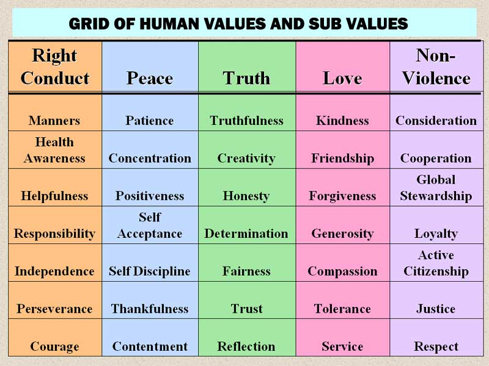
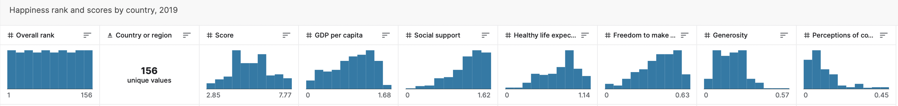

# **What Does it Mean to be Happy? Project Proposal :smiley:**

## Project Title:

### **What Does it Mean to be Happy?**
#### Code Name
- happiness-levels

## Authors
- Kunal Srivastava (kunalsr@uw.edu)
- Drew Blik (drewblik@uw.edu)
- Diego Felgueres (diegof20@uw.edu)
- Samiira Yusuf  (sy12345@uw.edu)

## Affiliation
- INFO-201: Technical Foundations of Informatics - The Information School - University of Washington

## Date
- November 2022

## Abstract
Our main goal is to assess levels of happiness across the globe as they relate/overlap with relevant metrics like GDP, social support, and life expectancy. To address these questions, we plan to analyze the 2019 World Happiness Report for relationships between several variables to create data visualizations and representations and help explain happiness across the globe.

## Keywords
- mental health
- happiness
- mood

## Introduction
For our project, we chose to gather data in regards to happiness. Our focus is on analyzing the 2019 Report from the Gallup World Poll and the variables that come with it. We find this topic of significant value due to its direct relationship with mental health. That’s why we aim on finding a correlation between the given variables in the data and the happiness index. By evaluating the trends, outliers, and factors such as location, GDP, freedom of making choices, and more; we hope to further understand and visualize what it is that makes us happy. Having this information at reach can be found helpful in the making of new policies, decision-making, and further projects that could benefit from this data.

## Problem Domain

### Project Framing
This project is operating within the many boundaries of human experience. Happiness is a concept that many philosophers spend their lives trying to define, but happiness is difficult to quantify. This project takes into account factors such as health, economic conditions, and freedom to determine which factors correlate most with happiness. This is a project that can apply to any human because we all seek to achieve happiness in one form or another. This project is also limited in terms of individual experience. For example, a country’s GDP per capita could be quite high, but this number could be misrepresentative due to the unequal allocations of wealth in certain countries, like the United States.

### Human Values
The human value that is at the forefront of this project is happiness. But the factors that we will investigate in relation to happiness can be defined through human values as well. Health can be defined as the value of self-discipline because one must be disciplined enough to take care of their own body. Health can also be linked to love and compassion because if you are unable to take care of yourself for whatever reason, those who love you will show compassion in helping you stay healthy. The World Health Organization indicates that all of these values play an integral role in health. Economic prosperity is difficult to assign a value because many factors contribute to it. On an individual level, it can be linked to your perseverance, concentration, and creativity. On a communal level, economic prosperity and freedom can be linked to global stewardship and cooperation. A study in the Chinese journal of Sociology found that a country’s political relationships can have a significant impact on wealth. Attached is a figure laying out these human values, classifying them under different terms.

Figure 1: Grid of Human Values and Sub-Values

### Direct and Indirect Stakeholders
The direct stakeholders in this project include us as the data analysts, the INFO 201 class as viewers of this project, and Professor Hendry. The indirect stakeholders include those who will not use this project, but might be affected by it. For example, if a policy maker were to make a legislative decision based on this project to make their community more happy, those impacted by that legislation would be indirect stakeholders.

### Possible Harms
Possible harms of this project include misinterpretation of the data. Hypothetically, if the data determined that the happiness countries are all in the Middle East, one might interpret that to mean that the cultures of the Middle East are better at inducing happiness than others. This might lead them to make decisions to replicate Middle Eastern countries cultures, even if the culture isn’t necessarily related to the happiness of the countries.

### Possible Benefits
The possible benefits of this project is to serve as a general guide on what factors are most conducive to happiness! By learning what factors contribute most to happiness, we could learn how to orient our lives to pursue the highest happiness. For example, if it turns out that health is a larger determinant of happiness than wealth, some might decide to spend more time exercising and less time at work.

## Research Questions
- **What are the top 5 happiest countries?**
 - We want to find the happiest countries to find important factors that are tied with countries with a high happiness index. This is important because if we see that most of the countries have strong culture (for example), that could be a potential factor to explore later.
- **What is the relationship between health and happiness?**
 - We want to find a relationship between health and happiness to help explain a country’s happiness score. If we can see that countries with large access to health care tend to be happier, areas with low happiness scores could be depleted of health resources, money, etc, which isn’t right.
- **What is the relationship between a national economy and national happiness score?**
 - We want to find the relationship between national economic success and happiness. This is an interesting question because the value of money vs. happiness is constantly debated. We are interested in seeing if there is any type of relationship between these two variables.
- **What is the relationship between freedom and happiness?**
 - While we expect this relationship to be pretty positive, this is a good question to confirm the validity of our dataset, and therefore our other research questions. Confirming a relationship between these two variables will help give us concrete observations.  

## The Dataset
The World Happiness Report is a landmark survey of the state of global happiness. This data was collected in 2019 for the purpose of researching global happiness and 6 factors contributing to happiness. The variables in this data don’t affect the the total score reported for each country, but they do explain why some countries rank higher than others. For this project we are measuring happiness and picked four variables out of  six, which include health, country, economy and freedom and how they relate to happiness. According to the website we are retrieving data from; the happiness scores and rankings use data from the Gallup World Poll. The scores are based on answers to the main life evaluation question asked in the poll. This question, known as the Cantril ladder, asks respondents to think of a ladder with the best possible life for them being a 10 and the worst possible life being a 0 and to rate their own current lives on that scale. The scores are from representative samples. Using the data from the figure below we will be able to make conclusions about the relationship between variables and how these variables affect the overall score of happiness. Furthermore, with the 4 factors we selected: health, country, economy, and freedom, we are able to measure how they correlate with the level of happiness using a scatter plot, to observe and visually display the relationship between variables. With the data we are provided we are also  given a benchmark with our variables as to how low they can perform. Dystopia as an imaginary country that has the world’s least-happy people. The purpose in establishing Dystopia is to have a benchmark against countries that can be favorably compared to a country that cannot be performed lower than, in terms of each of the six key variables. Lastly the data we selected has several benefits that include  allowing  governments, organizations, and healthcare metrics and evaluators to inform their policy-making decisions around factors that can contribute to happiness. Data evaluations can be used as an important resource as a measurement of well-being that can be used to effectively assess the progress of nations.

Figure 2: Data Description

Dataset: [link to dataset](https://www.kaggle.com/datasets/unsdsn/world-happiness?resource=download&select=2019.csv)

## Expected Implications
There are many learnings and observations one can make from these research questions. If increasing one’s country’s happiness score is a goal, policymakers could use this analysis to push for better infrastructure, education, and support towards minorities, as they could all be factors in overall happiness country-wide. Designers can design products with a user’s happiness in mind. This means creating great user experiences that align with the product’s purpose, unlike the current addictive-behavior of social media. Finally, technologists and users are the largest group. Just being aware of the factors of happiness and how they can change can greatly increase both awareness and happiness of technologists and typical users.

## Limitations
We may be limited by the fact that this data is 3 years old, and that there is no newer data on Kaggle for us to use. This could prove to be a disadvantage because it would be really interesting to see how COVID-19 and recent events across the world have affected global happiness levels, and if they've been affected in specific areas, it would be interesting to see why. Maybe in the future we can add newer data to our analysis.

## Acknowledgements
Thank you to our professor and TA for their efforts in this class.

## References
- “World Happiness Report.” Www.kaggle.com, www.kaggle.com/datasets/unsdsn/world-happiness?resource=download&select=2019.csv.

- World Health Organization. “Determinants of Health.” Www.who.int, World Health Organisation, 3 Feb. 2017, www.who.int/news-room/questions-and-answers/item/determinants-of-health.
‌
- World Health Organization. “Determinants of Health.” Www.who.int, World Health Organisation, 3 Feb. 2017, www.who.int/news-room/questions-and-answers/item/determinants-of-health.
‌
- “U.S. Net Worth Statistics: The State of Wealth in 2022.” FinanceBuzz, 18 Aug. 2021, www.financebuzz.com/us-net-worth-statistics.
‌

## Appendix A: Questions
N/A
